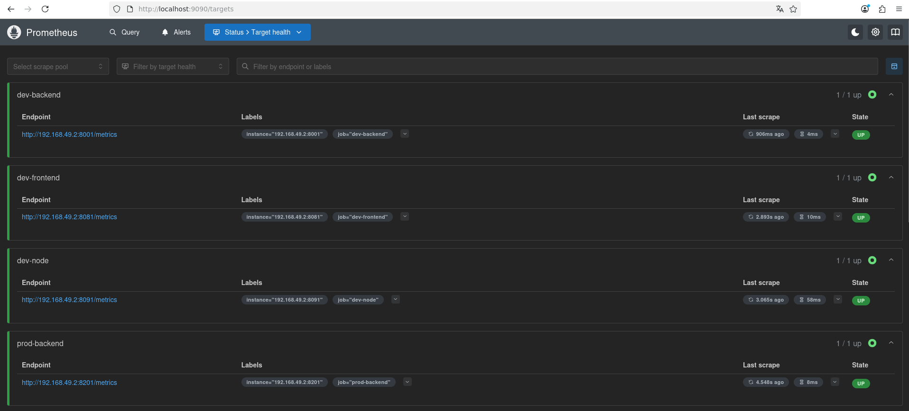
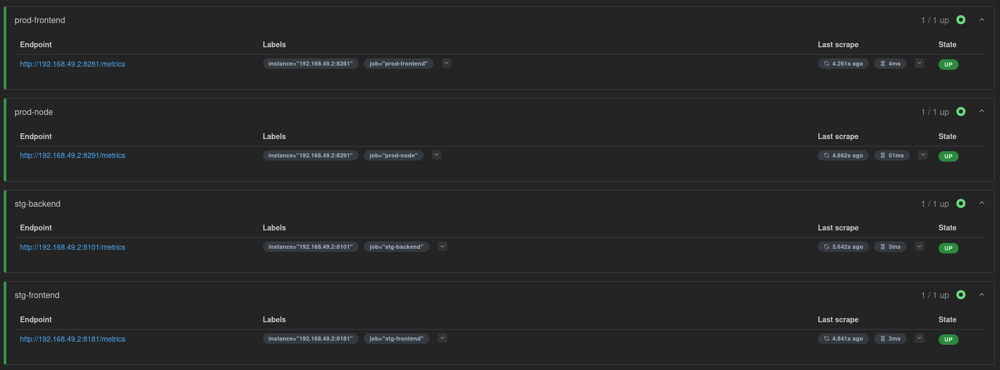
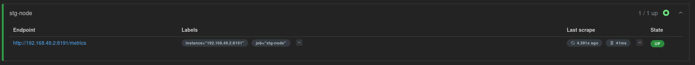
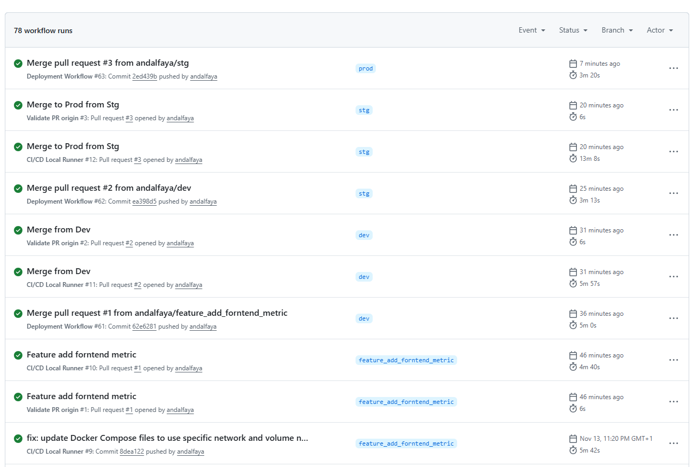
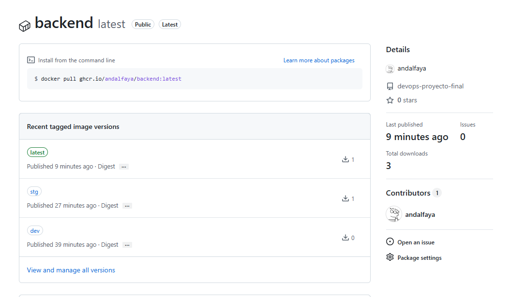
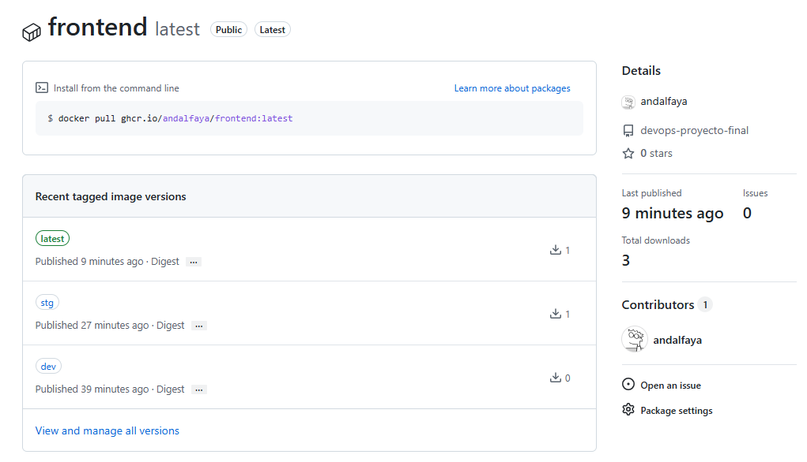
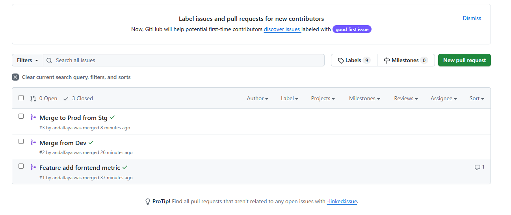
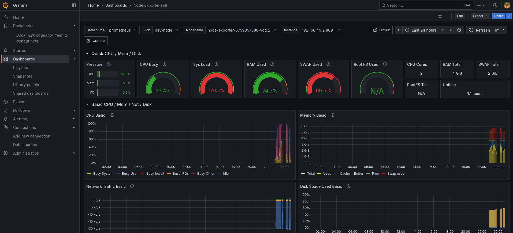

# DevOps Proyecto Final

Proyecto Final: Implementación de un workflow completo de DevOps combinando CI/CD, testing, IaC y monitoring para una aplicación containerizada.  
Se muestra cómo la automatización y visibilidad mejoran la confiabilidad y velocidad en un contexto de I+D o ingeniería.

---

## 1. Análisis de despliegue: Kubernetes, Terraform y Ansible

### Entornos
- **Dev:** Merge de ramas `feature_*` → despliegue automático con `deploy.yaml`.
- **Stg:** Merge de `dev` → despliegue automático con `deploy.yaml`.
- **Prod:** Merge de `stg` → despliegue automático con `deploy.yaml`.

### Kubernetes
- **Deployments:** Imagen Docker publicada en GHCR, réplicas configurables, puertos diferenciados por entorno.
- **Services:** `ClusterIP` o `NodePort`, IP del servicio de Kubernetes, puertos expuestos para app y health checks.

### Terraform
- Provisiona infraestructura en Kubernetes.
- Recursos: namespaces (`dev`, `stg`, `prod`), deployments y services.
- Flujo: `init` → `plan` → `apply` (gestionado por workflow).

### Ansible
- Valida despliegue con playbooks:
  - Smoke tests en puerto `8080`.
  - Health checks en `/health` y `/metrics`.

### Flujo de ramas y despliegues

```text
┌────────────┐
│ any branch │
└────────────┘
      │
      ▼
┌────────────┐          ┌─────────────┐        ┌────────┐        ┌─────────────┐        ┌────────┐        ┌─────────────┐        ┌────────┐
│ feature_XX │  ────▶  │  CI/CD job  │  ────▶ │  dev   │ ────▶ │  CI/CD job  │  ────▶ │  stg   │ ────▶ │  CI/CD job  │  ────▶ │  prod  │ 
└────────────┘          └─────────────┘        └────────┘        └─────────────┘        └────────┘        └─────────────┘        └────────┘
                                                   │                                        │                                         │       
                                                   ▼                                        ▼                                         ▼       
                                             ┌────────────┐                           ┌────────────┐                            ┌────────────┐
                                             │ deploy.yaml│                           │ deploy.yaml│                            │ deploy.yaml│
                                             │ + Terraform│                           │ + Terraform│                            │ + Terraform│
                                             │ + Ansible  │                           │ + Ansible  │                            │ + Ansible  │
                                             └────────────┘                           └────────────┘                            └────────────┘
                                                   │                                        │                                         │       
                                                   ▼                                        ▼                                         ▼       
                                               ┌────────┐                               ┌────────┐                                ┌────────┐  
                                               │ dev env│                               │ dev env│                                │ dev env│  
                                               └────────┘                               └────────┘                                └────────┘  


```

---

## 2. Workflows

### 2.1 CI/CD Local Runner (`cicd.yaml`)

#### Disparadores
- Push a ramas `feature_*`.
- Pull Request hacia `dev`, `stg`, `prod`.
- Ejecución manual (`workflow_dispatch`).

#### Jobs principales
1. **load_thresholds:** Carga umbrales de calidad.
2. **generate_environment:** Levanta entorno de pruebas con Docker Compose.
3. **lint_test_quality:** Ejecuta `pylint` en backend y frontend.
4. **coverage_test_quality:** Ejecuta tests con `pytest` y valida cobertura.
5. **sonar_test_quality:** Análisis SonarQube con quality gate.
6. **trivy_test_quality:** Escaneo de seguridad con Trivy.
7. **clean_environment:** Limpieza de entorno de pruebas.
8. **report:** Informe consolidado de calidad.

#### Resultados esperados
- Linting, tests, cobertura, análisis estático y seguridad validados.
- Informe final consolidado.

#### Conclusión
Garantiza calidad y seguridad antes de merges y despliegues.

---

### 2.2 Validate PR Origin (`validate_pr_origin.yaml`)

#### Disparadores
- Pull Request hacia `dev`, `stg`, `prod`.
- Ejecución manual (`workflow_dispatch`).

#### Job principal: `check-origin`
- Valida que la rama origen cumple reglas:
  - `feature_*` → `dev`
  - `dev` → `stg`
  - `stg` → `prod`

#### Resultado esperado
- Solo se permiten PRs que respeten el flujo lineal.
- Bloqueo automático de merges no válidos.

#### Conclusión
Workflow guardián del flujo de ramas, integrado con `cicd.yaml`.

---

### 2.3 Deployment Workflow (`deploy.yaml`)

#### Disparadores
- Push a `dev`, `stg`, `prod`.
- Ejecución manual (`workflow_dispatch`).

#### Variables de entorno
- `REGISTRY`, `NAMESPACE`, `ENVIRONMENT`, `IMAGE_TAG`, `IMAGE_BACKEND`, `IMAGE_FRONTEND`.

#### Jobs principales
1. **build-and-push:** Construcción y publicación de imágenes en GHCR.
2. **check-minikube:** Verificación y arranque de Minikube.
3. **terraform:** Provisiona y aplica infraestructura en Kubernetes.
4. **ansible:** Valida servicios desplegados con playbooks.

#### Puertos y endpoints
- Backend y frontend: puertos dinámicos expuestos en `/health`.
- Minikube: IP obtenida con `minikube ip`.

#### Conclusión
Despliegues reproducibles y validados en cada entorno con integración de Docker, GHCR, Minikube, Terraform y Ansible.

---

## 3. Imágenes y logs

### 3.1 Imagenes

#### 3.1.1 Protheus




#### 3.1.2 Github





#### 3.1.3 Grafana


### 3.2 logs de Kubernetes

```text
===== Pods en namespace: dev =====
NAME                             READY   STATUS    RESTARTS   AGE
backend-8cf6894fc-ctc4j          1/1     Running   0          30m
frontend-7c87cdd78b-jgvgx        1/1     Running   0          30m
node-exporter-6759897888-vqtc2   1/1     Running   0          30m
postgres-0                       1/1     Running   0          30m
===== Pods en namespace: stg =====
NAME                             READY   STATUS    RESTARTS   AGE
backend-565db6467b-crj7v         1/1     Running   0          20m
frontend-8fbf985d9-kj47s         1/1     Running   0          20m
node-exporter-6759897888-k7llw   1/1     Running   0          20m
postgres-0                       1/1     Running   0          20m
===== Pods en namespace: prod =====
NAME                             READY   STATUS    RESTARTS   AGE
backend-777fc48dbf-x829c         1/1     Running   0          2m29s
frontend-55f8bb68fd-r79qm        1/1     Running   0          2m28s
node-exporter-6759897888-xklhh   1/1     Running   0          2m30s
postgres-0                       1/1     Running   0          2m28s
```

[Ver log completo de despliegue](documentos/kubernetes.log)

---

## 4. Conclusión general

El proyecto integra:
- **CI/CD** con validaciones de calidad y seguridad.
- **Control de flujo de ramas** con reglas estrictas de PR.
- **Despliegue automatizado** en entornos aislados (`dev`, `stg`, `prod`).
- **Infraestructura como código** con Terraform.
- **Validación post-deploy** con Ansible.
- **Monitorización** con Prometheus (opcional).

Este README documenta el flujo completo de DevOps, asegurando calidad, seguridad y reproducibilidad en todo el ciclo de vida de la aplicación.
